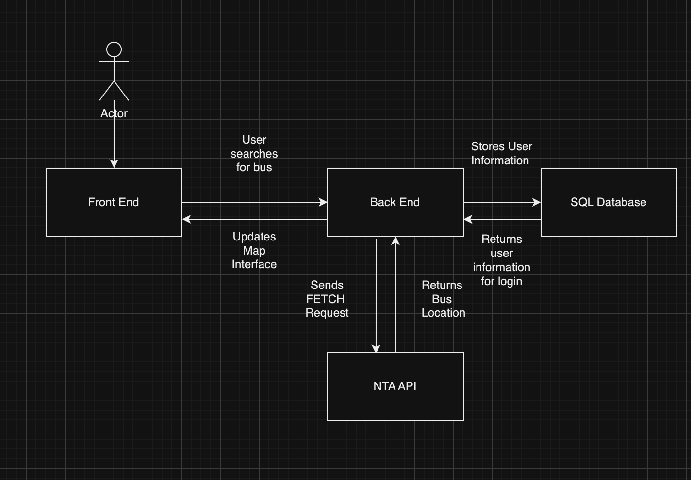
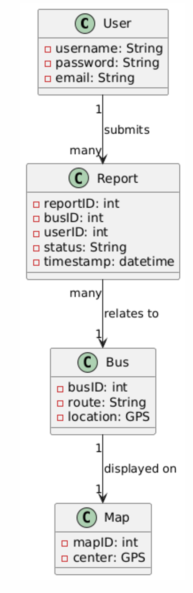
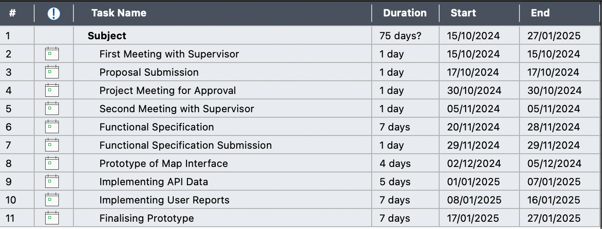
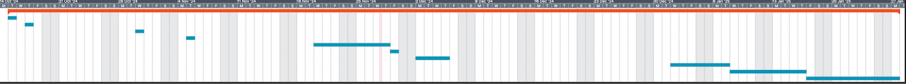

**Year 3 Project**  
\[CSC1049\]

**Live Bus Tracker with Crowdsourcing**  
\[Functional Specification\]

| James O’Meara | [james.omeara6@mail.dcu.ie](mailto:james.omeara6@mail.dcu.ie) | 22396256 |
| :---: | :---: | :---: |
| Michael Cojocaru | [michael.cojocaru2@mail.dcu.ie](mailto:michael.cojocaru2@mail.dcu.ie)  | 22380876 |

**Contents:**  
1\. 	Introduction										p.2  
1.1 	Overview										p.2  
1.2 	Business Context									p.2  
1.3	Glossary										p.3  
2\.	General Description									p.3  
2.1	Product / System Functions								p.3  
2.2	User Characteristics and Objectives							p.4  
2.3	Operational Scenarios									p.4  
2.4	Constraints										p.5  
3\.	Functional Requirements								p.6  
3.0.1		User Registration								p.6  
3.0.2		User Login									p.6  
3.0.3		Check Stop									p.7  
3.0.4		View Live Bus									p.7  
3.0.5		View All Bus Reports								p.7  
3.0.6 		Search										p.7  
3.0.7		Submit Bus Report								p.8  
3.0.8 		React to Bus Report								p.8  
4\.	System Architecture									p.9  
4.0.1		Front End									p.9  
4.0.2		Back End									p.9  
4.0.3		NTA API								             p.10  
4.0.4		SQL Database								             p.10  
5\. 	High Level Design									p.11  
6\. 	Preliminary Schedule								             p.13  
7\. 	Appendix									             p.14  
**1\. Introduction**

**1.1	Overview**  
The Live Bus Tracker with Crowdsourcing will be a web app that’ll allow users to get a visual perspective of the live location of buses on a map. Additionally users will be able to view and submit reports of the availability of buses. This’ll be reflected in the estimation of the arrival time of a bus as well as the live location of the bus on the map.

In some ways, the handling of the bus reports will resemble social media, with users requiring accounts to submit and “react” to reports. Users will be able to like and dislike bus reports as well as leave replies to bus reports. Accounts will hold a Reputation score which represents the ratio of likes to dislikes a user holds, with higher scores representing more trustworthy users.

A core focus of the web app is providing ease of use so users are encouraged to log in and contribute, providing more accurate bus times and a better experience for all users.

**1.2	Business Context**  
Tools that provide users with information on public transport either as apps or web apps are a necessity when navigating without a car today in Ireland. The National Transport Authority’s new app, TFI Live released on the 14th of February 2023, has over 500 thousand downloads on the Google Play store alone and other global based transport apps such as Moovit boasts of hundreds of millions of users monthly.

Our goal isn’t to compete with these apps but to provide a more comprehensive tool that can better describe the state of a singular bus route. With that being said, our bus tracker app can have similar business contexts to these types of apps:

* **Advertising**  
  The web app could have internal advertising. This could be general advertising in the form of banner ads at the edges of certain pages.  
* **Subscription Service**  
  Some sort of paid subscription service can be implemented that will allow users to have no ads and gain more information about the routes around them. Public transport apps such as Moovit and Transit have subscription models that offer various features. This could also give certain benefits from the social side of the app, such as highlighted messages.

**1.3	Glossary**

* **SQL**  
  Acronym for Standard Query Language, a programming language used to manage data, in this document it will be used whenever referencing a database.  
* **False Report**  
  The term this document will use to describe user reports on bus times that are inaccurate whether purposefully or not.  
* **NTA API**  
  Acronym for National Transport Authority Application Programming Interface, referring to the API that NTA provides which gives bus schedules and real time GPS data of buses, specifically, GTFS-Realtime.  
* **Leaflet.js**  
  Leaflet is a JavaScript library we will be using to build our web mapping application, in conjunction with OpenStreetMap, an online updated map of the world.

**2\. General Description**

**2.1	Product / System Functions**   
Below is a list of the main functions of our project. This is a preliminary list and is open for changes should we think of anything needing to be changed during the implementation stage of development. These will be expanded upon in Section 3\.

* **Account Functionality**  
  Users will have the ability to register accounts with the web app and login. Users will need to have an account to be able to submit bus reports. Accounts will carry a Reputation score depending on the like to dislike ratio of their posts.  
* **Map Interface**  
  Provide the user with a map interface that is up to date and shows implemented bus stops. A search bar will be displayed to quickly find specific stops and routes.  
* **Live Bus Schedule**  
  Show estimated bus times for any selected stop based on data from NTA API, also show updated times based on user bus reports separately. Buses can be visually shown moving on the map interface.  
* **Reports on Buses**  
  View and submit reports on a bus. This can be the time a bus has not arrived or the time a bus has left and can optionally include any information a user would like to provide. This will be reflected in the live bus schedule.

* **React to Bus Reports**  
  Buses reports can be replied to with messages as well as reacted to with likes and dislikes and can be reported to moderators.  
* **View All Reports**  
  A menu will allow users to see all bus reports submitted in a timeframe and have their location highlighted on the map. This can be filtered by bus route.

**2.2	User Characteristics and Objectives**  
The web app will be easily accessible with a user-friendly interface so as to accommodate users with little or no knowledge of computing. The site should be accessible to anyone with an Android or Apple phone. We hope to cultivate a community of users who enjoy using the app and as a result, are willing to properly submit reports. 

A key objective is making sure that users are not sending false reports, this is where replies and reactions to bus reports including moderation can come into play.

**2.3	Operational Scenarios**   
Due to the account functionality, there will be different scenarios under which a user may visit the site. These give different authorisation levels for users and different functions considering if they are logged in or not. These are:

* **Unregistered User (not logged in)**  
  An unregistered user can still view the front page of the web app, where they will be shown an interactive map. Unregistered users can still view the functionality of the site such as the live buses and their reports but can not contribute themselves. Tying users to accounts with Reputation scores encourages them to not send false reports.  
    
  * ***Register:***  
    A user must register in order to contribute to the web app. The user navigates to the "Register" page and enters a username, email, and password and the system validates it.  
  * ***Login:***  
    A User can log in to access their account. This’ll allow the user to access the full functionality of the web app.  
  * ***Check Stop:***  
    The user can select a stop to view all of the buses set to arrive. The stop will show bus schedule times and live data from NTA API as well as live data updated by our user bus reports. The user then can select to view the bus live on the map.  
  * ***View Live Bus:***  
    This will show the user a live visual of the bus's approximate location on the map according to NTA API, as well as show bus reports.  
  * ***View All Bus Reports:***  
    This will show the user all of the bus reports submitted in a timeframe and can be filtered by bus route.  
  * ***Search:***  
    The user can search for a specific bus or stop using the search bar at the top of the screen.

* **Registered User (logged in)**  
  The registered user loses access to registering or logging in to a new account until they log out, but gains all other functionality. They gain the ability to submit bus reports and reply to bus reports.

  * ***Submit Bus Report:***  
    The user can report a bus delay or early arrival by selecting a bus on the map. They are then presented with a simple form to say whether the bus was early or late and add comments if necessary.  
  * ***React to Bus Report:***  
    React encompasses all the ways a bus report can be interacted with by a user, such as liking or disliking the report, sending an actual reply message to the report or reporting the bus report to the moderation team.

**2.4	Constraints**

* **Server Requirements**  
  The web app must handle a lot of concurrent users, especially around rush hours, without degrading the performance. This involves ensuring that the server can process the real-time GPS data, user-submitted bus reports, and database queries efficiently without significant delays or crashes.  
* **Speed Requirements**  
  The data from the NTA API has to be called regularly in order to keep the positioning accurate. The API should be called at 5 minute intervals.   
* **Data Processing**  
  Since the system is constantly fetching data from the NTA API. These calls must be managed in order to prevent overloading the server. As well as that, user reports must be processed in real time and shown on the map interface, so this must be reflected in the read and write procedures.  
* **Working with Users Data**  
  As the system relies on user-submitted reports, it’s necessary that we have methods to ensure that the reports are as accurate as possible and have a method for handling conflicting user reports. This includes handling users with low Reputation scores.

**3\. Functional Requirements**

**3.0.1	User Registration**  
**Description:** This function enables new users to create an account, which would be necessary to use the functions of the site. The linked form on the home page would require the user to input their email and create a username and password. Once these inputs have been passed through verification to ensure they fit criteria (the format of an email address and an acceptable password strength). Once the user is added to the user database they can log in.  
**Criticality:** Registering new users is vital for the web app, as it allows for users to contribute to the site. Without this functionality, users would not be able to submit or react to bus reports. We do not want users to anonymously submit bus reports as it may increase the incentive to submit false reports. Tying users to an account with a Reputation score will disincentivize maliciously using bus reports and makes it easier for moderators to manage bus reports.  
**Technical Issues:** The registration form will be designed in React, which will access our SQL database in order to store user information. We want to make registering as quick and easy as possible to encourage users to contribute and this involves ensuring that the performance of the site is good.  
**Dependencies:** None.

**3.0.2	User Login**  
**Description:** This function allows users to access the account they have created. On the login page, the user enters their username and their password. This information is then checked against the user database, and if they are a match, the user is able to contribute to the site by creating or replying to bus reports. If the inputted information is incorrect and doesn’t match, an error message is displayed.  
**Criticality:** Login functionality is crucial for securing user accounts and ensuring that only authorised users can submit bus reports. The reporting aspect of the site is the most critical part and what makes us unique so ensuring that users can log in to their created accounts is vital.  
**Technical Issues:** The system will access their particular user entry in the users table. We want to make logging in as quick and easy as possible to encourage users to contribute and this involves ensuring that the performance of the site is good.  
**Dependencies:** User Registration.

**3.0.3 Check Stop**  
**Description:** This function allows users to view buses' estimated time of arriving at a stop by their schedule times, live GPS data from NTA API as well as live data updated by our user reports. Users simply have to tap on a stop to access it.  
**Criticality:** Checking bus stops is central to the app's purpose and without this functionality, the user would have no way of interacting with the bus data.  
**Technical Issues:** The map is made with Leaflet.js and displays data fetched from the NTA API including stops. Displaying stops accurately on an interactable map will be a challenge to figure out, especially because we must account for different phone resolutions and zoom levels.  
**Dependencies:** Data from NTA.

**3.0.4 View Live Bus**  
**Description:** This function allows users to view the location of a bus live on the map with its route highlighted as well as its compiled reports. Users can select the bus from the check stop function or search function. The bus will be represented by an icon on the map. The representation will reflect schedule times or live GPS data from NTA updated by our user bus reports, depending on what is available.  
**Criticality:** Viewing the bus's location live on the map helps the user gain a visual representation of where their bus is. It is, however, not necessary to the app’s function but absolutely something that will drastically improve the user experience. Though viewing individual bus reports is quite important in order for users to reply.  
**Technical Issues:** The bus will travel along routes set on our map made with Leaflet.js. Implementing this will be a challenge.  
**Dependencies:** Data from NTA.

**3.0.5 View All Bus Reports**  
**Description:** This function allows users to view all bus reports regardless of bus and bus stop and filter by bus route. The stops these reports were submitted from will be highlighted on the map.  
**Criticality:** Not critical to the site but important as it improves user experience nonetheless.  
**Technical Issues:** None.  
**Dependencies:** None.

**3.0.6 Search**  
**Description:** This function allows the user to search for specific bus routes and stop numbers. User’s can select bus routes to see the route highlighted on the map.  
**Criticality:** Quite important for users to quickly find their desired buses but not absolutely critical for the site’s function.  
**Technical Issues:** Users may input general information, such as the end location of a bus route and not its number. It is required for us to provide accurate estimates to what the user is searching for.  
**Dependencies:** None.  
**3.0.7 Submit Bus Report**  
**Description:** This function allows the user to report if a bus is running early or late. From the map interface, users select a bus from a stop or search and are presented with a form. They specify whether the bus is missing or has just arrived, choose the time if it’s different from the current time, and optionally add comments. Once submitted, the system validates the input and stores the report in the database. The report is then reflected on the bus’s user timetable, providing real-time updates for all users viewing the affected route.  
**Criticality:** This is a core feature of the platform, directly contributing to the accuracy of bus arrival predictions. Without this functionality, the system would rely solely on timetables or GPS data, which may not always be reliable or timely.  
**Technical Issues:** Reports for buses will be stored in an SQL database and be linked to each bus. Will be a challenge to do with good performance.  
**Dependencies:** User is registered.

**3.0.8 React to Bus Report**  
**Description:** This function allows the user to react to a bus report. This encompasses whether the user likes, dislikes, replies with a message or reports the bus report to moderation. A user can select a bus report to reply to from viewing an individual bus or the view all bus reports function. Like and dislike replies to a bus report will be reflected in the submitter's Reputation score.  
**Criticality:** This is an important feature of the platform, as it allows users to judge a user’s bus report and may influence how trustworthy a report is.  
**Technical Issues:** None.  
**Dependencies:** User is registered.

**4\. System Architecture**

  
***Fig. 1***

**4.0.1	Front End**  
The web app serves as the front end of the system. It will enable viewing the live map of buses, filling out bus reports, and navigating the system. The main focus of the frontend is to ensure that the users can complete the functions with minimal effort. The map interface, powered by Leaflet.js, will display bus locations and stops visually, making it easy for users to understand real-time data. Users will also be able to search for buses or stops and interact with bus reports directly through this interface.

**4.0.2	Back End**  
The backend facilitates communication between the front end, the SQL database and external components like the NTA API. It will fetch real time GPS data from the API at regular intervals and update the tracking of the bus. It will also validate and store the Users and user submitted reports in the SQL database so that all given data is accurate.

**4.0.3	NTA API**  
The NTA API is the external service used to fetch the GPS data of the bus's location. The backend queries the NTA API at regular intervals to ensure that the displayed bus locations on the map are accurate and up-to-date. This data can also be cross-referenced with user-submitted reports to improve prediction accuracy.

**4.0.4	SQL Database**  
The SQL Database securely stores user account information, such as usernames, emails and encrypted passwords, alongside user-submitted bus reports and their associated details. The data will be accessed from this database when calculating the more accurate positioning of the buses when utilising the user submitted reports.

**5\. High Level Design**  
****  
***Fig. 2***

**Step 1: Register**  
Users register a username, email and password which allows them to log into the site.

**Step 2: Login**  
Users enter the same username and password they entered when registering allowing them access to contribute to the site.

**Step 3: View Map**  
Shows the position of stops on the map overlay.

**Step 4: View Stop**  
Shows the estimated times for a bus arriving at a selected stop.

**Step 5: Submit a Bus Report**  
Users select a bus from a stop to submit a bus report. They can indicate whether a bus is early, late or on-time and add optional comments.

**Step 6: View Bus Reports**  
Click on a bus to view existing reports. Reports include details like timestamps, user comments, and reactions from other users, giving insight into route conditions.

**Step 7: React to Bus Reports**  
Users can react to bus reports submitted by others using like or dislike options. These reactions help other users judge the credibility of reports.

**Step 8: Log Out**  
Once finished, users can log out to ensure account security and prevent unauthorized access.

**6\. Preliminary Schedule**

The schedules below were designed using MindView 9 software. Fig. 3 shows a full list of tasks and Fig. 4 shows a Gantt chart which displays a broader overview of when these tasks are to be completed.

Each upcoming task concerns implementing a different set of resources. Task 8 will concentrate on using Leaflet.js and OpenStreetMap to make the initial working interface in our web app. Task 9 will tackle the NTA API, we have to learn to read its data and figure out how to implement it. Task 10 concerns implementing user functionality and finally in task 11, we hope to be putting our finishing touches.

The Gantt chart is also useful for showing us what tasks must be completed before another task can begin. However, the tasks and dates on both figures are rudimentary, and we hope to figure out a proper schedule after the Christmas break.

****  
***Fig. 3***

  
***Fig. 4***

**7\. Appendix**

* **Resources**  
  * [https://developer.nationaltransport.ie/apis](https://developer.nationaltransport.ie/apis)  
    APIs provided by NTA  
  * [https://leafletjs.com/](https://leafletjs.com/)  
    Leaflet.js website  
  * [https://www.openstreetmap.org/](https://www.openstreetmap.org/)  
    OpenStreetMap website
